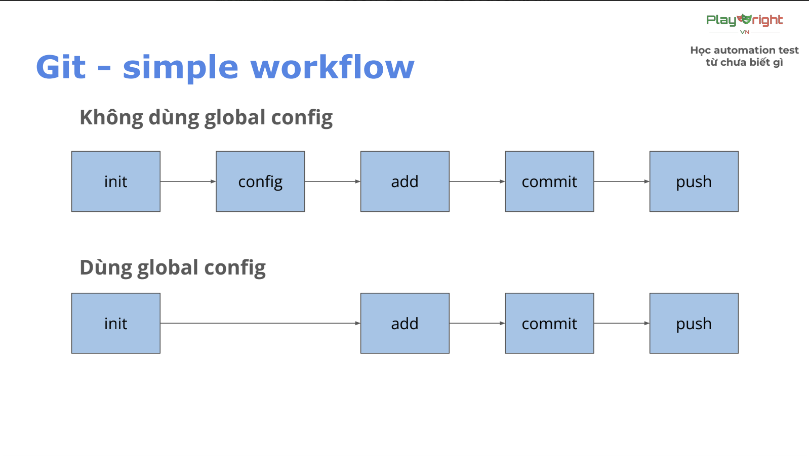

# Version control system
1. **Định nghĩa**
- VCS (Version Control System): Hệ thông quản lý các phiên bản
2. **Các loại VCS**
- *Local*: Lưu ở máy cá nhân
- *Centralize*: Lưu ở 1 máy chủ tập trung
- *Distributed*: lưu ở nhiều máy khác nhau
# Git
1. **Khởi tạo git**
- Câu lệnh: `git init`
2. **Cấu hình git**
- *Cấu hình cho 1 repo cụ thể*
    - `git config user.name "<name>"`
    - `git config user.email "<name>"`
- *Cấu hình cho toàn bộ máy tính*
    - `git config --global user.name "<name>"`
    - `git config --global user.email "<name>"`
3. **Thêm file vào vùng staging**
- *Thêm 1 file*
    - `git add <file_name>`
- *Thêm toàn bộ file*
    - `git add .`
4. **Xem trạng thái file**
- Câu lệnh: `git status`
- File màu xanh: vùng staging
- File màu đỏ: vùng working directory
- File màu xám: repository
5. **Commit**
- *Câu lệnh*: `git commit -m"message"`
- *Kiểm tra lịch sử commit*: `git log`
- *Commit convention:* `<type>: <short_description>`
    - type: loại commit
        - chore: sửa nhỏ lẻ, chính tả, xóa
file không dùng tới,...
        - feat: thêm tính năng mới, test
case mới
        - fix: sửa lỗi 1 test trước đó
    - short_description: mô tả ngắn gọn
(50 kí tự), tiếng Anh hoặc tiếng Việt
không dấu.
6. **Git simple workflow**

# JavaScript
1. **Console log/span>**
- Đây là lệnh in ra màn hình: `console.log(<biến cần in ra>)`
2. **Variable**
- Cấu trúc: <tên biến> <giá trị của biến>
- Các kiểu khai báo biến
    - var: khai báo lại được, phạm vi cụ bộ (global)
    - let: k khai báo lại được, phạm vi trong cặp ngoăc {}
    - const: hằng số, khai báo các giá trị k thể thay đổi
3. **Data type**
- Có nhiều kiểu dữ liệu: String, Number, Bigint, Boolean, Undefined, Null, Symbol, Object
4. **Comparison operator**
- *Comparison operator*: Dùng để so sánh giá trị giữa 2 biến với
nhau. Kết quả sẽ trả về Boolean (true
hoặc false).
    - So sánh hơn kém: >, <
    - So sánh bằng: ==, ===,!=, !==,>=, <=
- *Unary operator*: toán tử 1 ngôi, dùng để tăng hoặc giảm giá
trị
    - i++ bằng với i=i+1
    - i-- bằng với i=i-1
- *Arithmetic operator*: toán tử
số học, dùng tính toán giá trị biểu
thức
    - Các phép toán: +, -, *, /
5. **Condition**
- Conditional: điều kiện, dùng để kiểm tra
có nên thực hiện một đoạn logic không.
    - Cú pháp: if (<điều kiện>) { // code }.
6. **Loop**
- Loop: vòng lặp, dùng để thực hiện một đoạn logic một
số lần nhất định
    - Cú pháp: for(<khởi tạo>; <điều
kiện chạy>; <điều kiện tăng>) {
// code }
