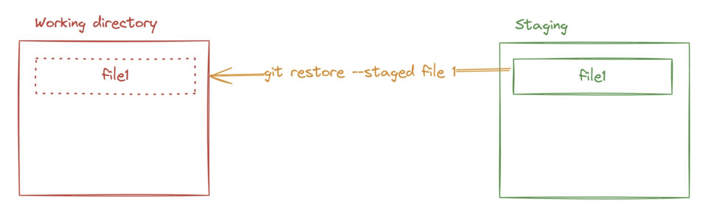
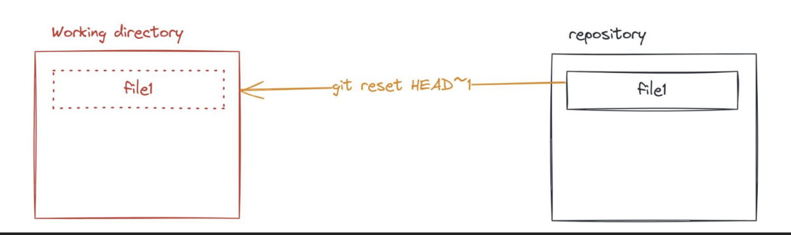

# Git
1. **Undo action**
- *Thay đổi commit message, có 2 cách*:
    - câu lệnh: `git commit --amend`
        - Gõ i -> vào chế độ insert -> điền nội dung msg cần update
        - Gõ esc để thoát insert
        - Gõ “:wq” -> write and quit
    - Câu lệnh: `git commit --amend -m"message”` (giống câu lệnh trên nhưng thay đổi msg trực tiếp chứ k cần vào mode insert)
- *Đưa từ vùng staging về working directory*
    - `git restore --staged <file>"`
    
- *Đưa từ vùng repository về working directory (uncommit)*
    - `git reset HEAD~1` (undo 1 commit gần nhất)
    - Note: k thể undo commit đầu tiên
    
- Câu lệnh dùng để bỏ qua các file không cần git theo dõi: `.gitignore file`
    - Ignore file: `<file name>`
        - Ví dụ:  trong .gitignore thêm dòng: file1.txt`
    - Ignore folder: `<folder name>/`
        - Ví dụ: trong .gitignore thêm dòng: folder-test/
2. **Branching model**
- Branch: Dùng branch để tạo ra một vùng làm việc mới, không ảnh hưởng tới vùng làm việc đã ổn định.
- Tạo branch
    - Tạo nhánh mới nhưng k chuyển sang: `git branch <ten_branch>`
        - Ví dụ: `git branch feature/login`
        - Sau lệnh này: 
            - Git sẽ tạo một nhánh mới tên là feature/login.
            - Vẫn đang ở nhánh hiện tại (thường là main hoặc master).
    - Chuyển sang một nhánh đã có: `git checkout <ten_branch>`
        - Ví dụ: `git checkout feature/login`
        - Sau lệnh này:
            - Sẽ rời nhánh hiện tại (ví dụ từ main) và chuyển sang nhánh feature/login.
            - Toàn bộ nội dung thư mục làm việc (working directory) sẽ cập nhật theo trạng thái của nhánh mới đó.
            - Note: Lệnh này chỉ dùng khi nhánh đó đã tồn tại.
    - Tạo và chuyển ngay sang một nhánh mới: `git checkout -b <ten_branch>`
        - Ví dụ: `git checkout -b feature/login
`       - Sau lệnh này:
            - Git sẽ tạo nhánh feature/login.
            - Chuyển sang nhánh đó ngay lập tức. (Nó tương đương 2 lệnh liên tiếp bên trên)
# JavaScript Basic
1. **Convention**
- snake_case: chưa dùng
- kebab-case: tên file
    - Ví dụ: file-test-01
- camelCase: tên biến
    - Ví dụ: firstName
- PascalCase: tên class
    - Ví dụ: CalculationAverageAge
2. **Console log**
- Console log với biến: `console.log(`${variable_name}`)`
    - Ví dụ: `let name = "Nga";`

            console.log(`Toi la ${name}`);
            console.log(“Toi ten la” + name+ “”)
                                  
3. **Object**
- Định nghĩa: đối tượng, dùng để lưu trữ tập hợp các giá trị vào cùng một biến hoặc hằng số
- Khai báo: `let/const <ten_object> = {<thuoc_tinh>: <gia_tri>,... }`

        - Trong đó:
            - <thuoc_tinh>: giống quy tắc đặt tên biến
            - <gia tri>: có kiểu giống biến, hoặc là 1 object khác.

- Ví dụ:

        let user = {
            “name”: “Alex”,
            “age”: 10,
            “email”: “alex@gmail.com”
            }

        const product = {
            “name”: “Laptop”,
            “price”: 500,
            “isWindow”: true,
            “manufacturer”: {
            “name”: “Acer”,
            “year”: 2024
         }

- Sử dụng:

        console.log("name = " + user.name);
        console.log("manufacturer name = " + product.manufacturer.name);
        console.log(“price = “, product[“price”]);

4. **Logical operator**
- && : cả 2 vế của mệnh đề đều đúng
- || : một trong 2 vế đúng
- ! : đảo ngược lại giá trị
    - Ví dụ:

            let a = 5;
            let b = 3;

            // &&: cả hai điều kiện đúng
            if (a > 3 && b < 10) {
            console.log("Cả hai điều kiện đúng");
            }

            // ||: một trong hai điều kiện đúng
            if (a < 3 || b < 10) {
            console.log("Ít nhất một điều kiện đúng");
            }

            // !: phủ định điều kiện
            if (!(a < 3)) {
            console.log("a không nhỏ hơn 3");
            }

5. **Array**
- Mảng (Array) là một kiểu dữ liệu dùng để lưu trữ nhiều giá trị trong một biến duy nhất, thay vì phải tạo nhiều biến riêng lẻ.
- Ví dụ:

        let fruits = ["apple", "banana", "mango"];
        console.log(fruits); // ["apple", "banana", "mango"]
        console.log(fruits[0]); // lấy phần tử đầu tiên apple
        console.log(fruits.length); // 3 (số phần tử trong mảng)

6. **Function**
- Function = hàm, là đoạn code được đặt tên và có thể tái sử dụng, thực hiện 1 nhiệm vụ hoặc 1 tính toán cụ thể 
    - Hàm đơn giản:
        
            function sayHello() {
            console.log("Hello, world!");
            }

            sayHello(); // Gọi hàm → In: Hello, world!

    - Hàm có tham số (parameter):

            function greet(name) {
            console.log("Hello, " + name + "!");
            }

            greet("Alice"); // In: Hello, Alice!
            greet("Bob");   // In: Hello, Bob!

    - Hàm có giá trị trả về (return)

            function add(a, b) {
            return a + b;
            }

            let result = add(3, 5);
            console.log(result); // 8

